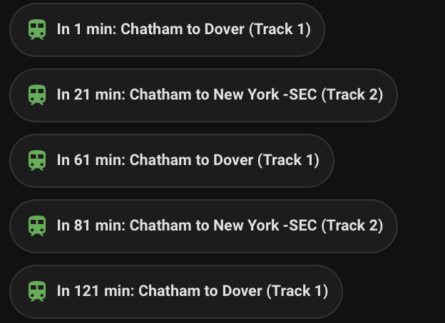

# NJ Transit for Home Assistant

This integration provides NJ Transit train schedules in Home Assistant. Not affiliated with NJTransit please follow the usage rules outlined on the [NJ Transit Developer Portal](https://developer.njtransit.com/registration/docs). 



## Features

- Real-time train schedules
- Next train departure times
- Station status and track information

## Installation

### HACS (Recommended)
1. Open HACS in Home Assistant
2. Click on tridot
3. Click the "Custom Respositories"
4. Paste this repo url
5. Select "Integration" type
6. Restart Home Assistant

### Manual Installation
1. Copy the `custom_components/njtransit` folder to your `custom_components` directory
2. Restart Home Assistant


### How To Use

Create a custom sensor template in configuration.yml.

```
template:
  - sensor:
      - name: "NJ Transit Schedule"
        state: >
          
          
            {% set date = strptime(trips[0].scheduled_date, '%d-%b-%Y %I:%M:%S %p') %}
            
            
            {{ mins }}min to {{ trips[0].destination }} (Track {{ track }})
          
            No upcoming trains
          
        attributes:
          trains: >
            
            
            
              {% set date = strptime(trip.scheduled_date, '%d-%b-%Y %I:%M:%S %p') %}
              
              
                
                
              
            
            {{ (data.trips|sort(attribute='minutes'))[:5]|tojson }}
```

Install mushroom cards from HACS, update your config, and reload.

```
lovelace:
  resources:
    - url: /hacsfiles/mushroom-cards/mushroom-cards.js
```
Now we can update your dashboard yml to include the data. I chose to display only the next 4 trains, though 5 are retrieved. The API has set limits on API calls per day so I have set the interval to 5 minutes. If you choose to show all 5, there is a scenario where the below would show an empty card for the 5th once the departure time has passed for the 1st, prior to the refresh.

```
- type: vertical-stack
  cards:
    - type: custom:mushroom-chips-card
      alignment: left
      chips:
        - type: template
          icon: mdi:train
          icon_color: green
          content: >
             
              In {{ trains[0]['minutes'] }} min: {{ state_attr('sensor.nj_transit_<your station>_station', 'station') }} to {{ trains[0]['destination'] }} (Track {{ trains[0]['track'] }})
            
    - type: custom:mushroom-chips-card
      alignment: left
      chips:
        - type: template
          icon: mdi:train
          icon_color: green
          content: >
             
              In {{ trains[1]['minutes'] }} min: {{ state_attr('sensor.nj_transit_<your station>_station', 'station') }} to {{ trains[1]['destination'] }} (Track {{ trains[1]['track'] }})
            
    - type: custom:mushroom-chips-card
      alignment: left
      chips:
        - type: template
          icon: mdi:train
          icon_color: green
          content: >
             
              In {{ trains[2]['minutes'] }} min: {{ state_attr('sensor.nj_transit_<your station>_station', 'station') }} to {{ trains[2]['destination'] }} (Track {{ trains[2]['track'] }})
            
    - type: custom:mushroom-chips-card
      alignment: left
      chips:
        - type: template
          icon: mdi:train
          icon_color: green
          content: >
             
              In {{ trains[3]['minutes'] }} min: {{ state_attr('sensor.nj_transit_<your station>_station', 'station') }} to {{ trains[3]['destination'] }} (Track {{ trains[3]['track'] }})
            
```

## Configuration

1. In Home Assistant, go to Settings → Devices & Services
2. Click "+ Add Integration"
3. Search for "NJ Transit"
4. Enter your NJ Transit API credentials:
   - API Key
   - Username

You can obtain API credentials from the [NJ Transit Developer Portal](https://developer.njtransit.com/registration/docs).

## Usage

After configuration, the integration will create a new sensors:
- `sensor.nj_transit_<your station>_station`

## Contributing

Contributions are welcome! Please feel free to submit a Pull Request. 